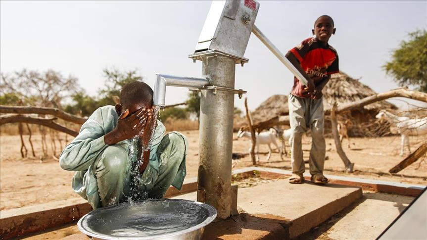
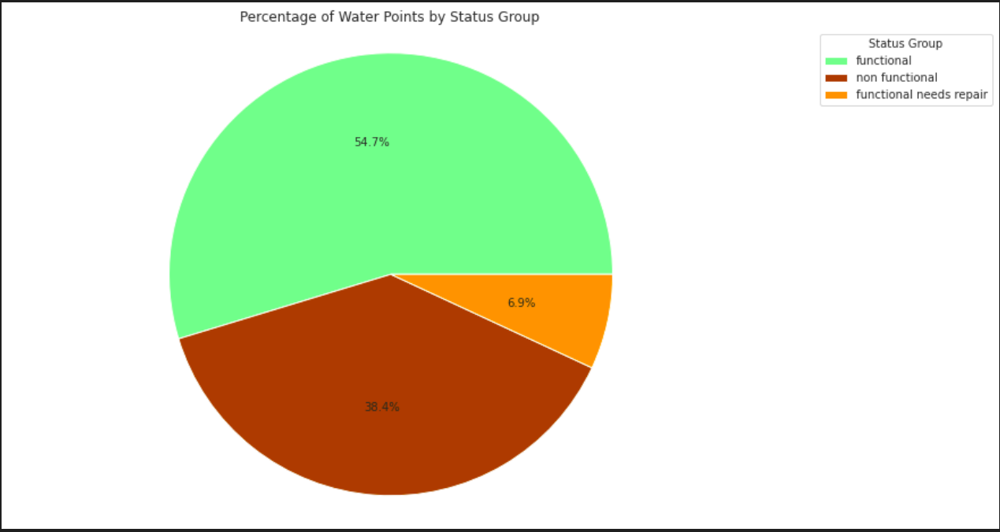
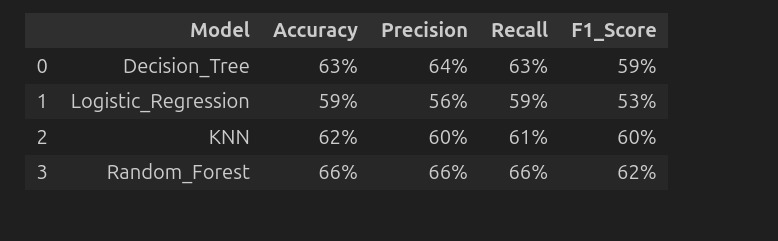

#  **PREDICTING OPERATING CONDITION OF WATER WELLS IN TANZANIA**

This is a machine learning project with models that predict the condition of water wells in Tanzania.

## Business Understanding
According to Water.org(2024), Tanzania faces a significant water and sanitation crisis, out of its population of 65 million people, 58 million people (88% of the population) lack access to safe water. People living under these circumstances, particularly women and girls, spend a significant amount of time traveling long distances to collect water. And other challenges like underfunding of planned government projects, population growth, and extreme weather events due to climate change create challenges for those living in poverty. Now more than ever access to safe water at home is critical to families in Tanzania

The project's main goal is to create a model for forecasting operational conditions of water points in Tanzania. With accurate predictions showing whether a water point will be working, broken, or under repair, the Tanzanian government will improve maintenance decision-making procedures, thereby making sure that communities have sustainable access to drinking water.

## Data Understanding

The data was sourced from from Taarifa (http://taarifa.org/) and the Tanzanian Ministry of Water(http://maji.go.tz/).

The data had 59400 indvidual data points and 41 columns

 ### The following are the column names

* amount_tsh - Total static head (amount water available to waterpoint)

* date_recorded - The date the row was entered

* funder - Who funded the well

* gps_height - Altitude of the well

* installer - Organization that installed the well

* longitude - GPS coordinate

* latitude - GPS coordinate

* wpt_name - Name of the waterpoint if there is one

* num_private -

* basin - Geographic water basin

* subvillage - Geographic location

* region - Geographic location

* region_code - Geographic location (coded)

* district_code - Geographic location (coded)

* lga - Geographic location

* ward - Geographic location

* population - Population around the well

* public_meeting - True/False

* recorded_by - Group entering this row of data

* scheme_management - Who operates the waterpoint

* scheme_name - Who operates the waterpoint

* permit - If the waterpoint is permitted

* construction_year - Year the waterpoint was constructed

* extraction_type - The kind of extraction the waterpoint uses

* extraction_type_group - The kind of extraction the waterpoint uses

* extraction_type_class - The kind of extraction the waterpoint uses

 * management - How the waterpoint is managed

* management_group - How the waterpoint is managed

* payment - What the water costs

* payment_type - What the water costs

* water_quality - The quality of the water

* quality_group - The quality of the water

* quantity - The quantity of water

* quantity_group - The quantity of water

* source - The source of the water

* source_type - The source of the water

* source_class - The source of the water

* waterpoint_type - The kind of waterpoint

* waterpoint_type_group - The kind of waterpoint

#### The labels in this dataset are simple. There are three possible values:

* functional - the waterpoint is operational and there are no repairs needed

* functional needs repair - the waterpoint is operational, but needs repairs

* non functional - the waterpoint is not operational

##### Distribution of wells by functionality 

### MODELLING

For this study the following models were employed:

1. Decision Tree
2. Logistic Regression
3. K-Nearest Neighbors
4. Random Forest

### EVALUATION

For this project the following evaluation metrics were used to rate the performance of the models used :

Accuracy

Precision

Recall

F1 Score

### Findings
The Random Forest algorithm, having the highest precision score of all performed better than the other models and shall be used as the final model The precision score of the model was 66% which means that it was able to precisely determine the status of the waterpoint 66% of the time